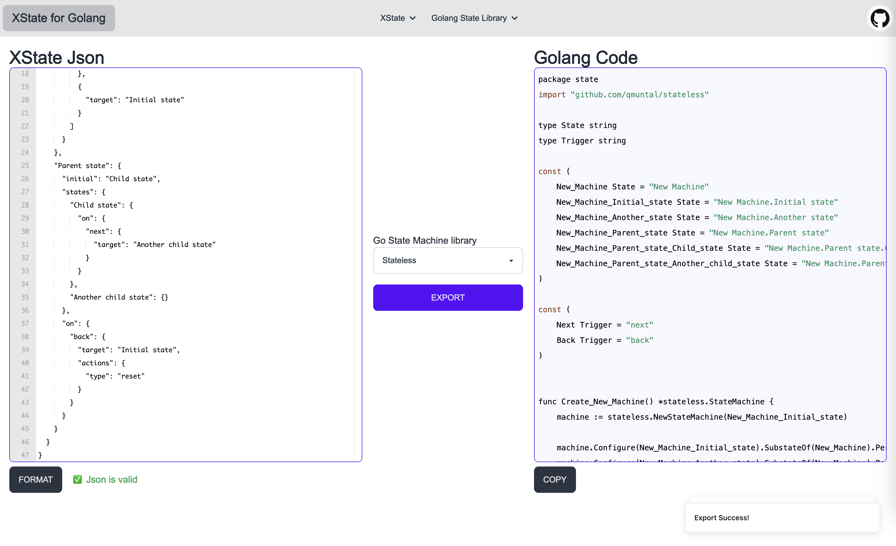

    </a>

Convert XState json to golang code

[Live Demo](https://xstate.zeabur.app)

## Getting Started
make state machine in stately studio. and export json file.

[Getting Start](./docs/getting-start.md)

## Features
| XState | Stateless | FSM |
| --- | --- | --- |
| State | ✅ | 🚧 |
| Event | ✅ | 🚧 |
| Self-transition | ✅ | 🚧 |
| Parrallel | 🚧 | 🚧 | 
| Action | 🚧 | 🚧 |
| Invoke | ❌ | ❌ |

## Learn More

What is XState

what is Stately Studio

What is State Machine in Golang

## Usage
